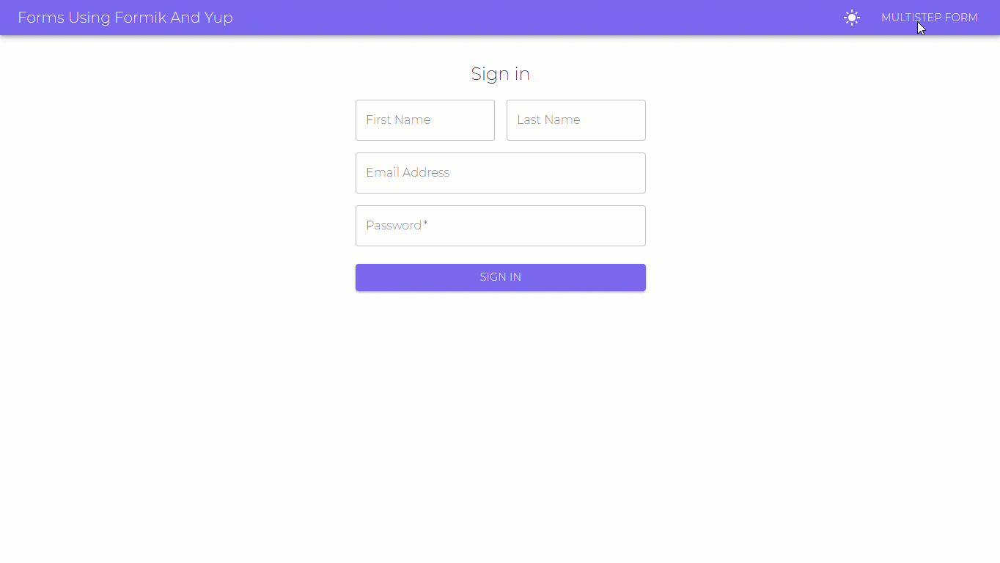

# Forms Using Formik, Yup and TypeScript

## [Live](http://forms-with-formik.surge.sh/)

# Features
- Supports Dark Mode.

## Multistep Form
- This form has 3 three steps.
- In step 2, balance needs to the 1 million if the `I am a millionaire` checkbox was marked.

## Signup Form
- Includes strict validations
# Folder Structure
| File name 　　　　　　　　　　　　　　| Description 　　|
| :--  | :--         |
| `└── src` (directory) | Contains the source files for this project. |
| `　　└── components` (directory) | Contains Three components.|
| `　　　　├── FormikStepper` (directory) | Contains the FormikStepper component for multistep form. |
| `　　　　├── Multistep` | Contains the multistep form creation. |
| `　　　　└── Signin` | Contains the signin form creation. |
| `　　├── App.tsx` | Entry component for the application. |
| `　　├── index.css` | Contains Global CSS |
| `　　└── index.tsx` | The main index file. |

